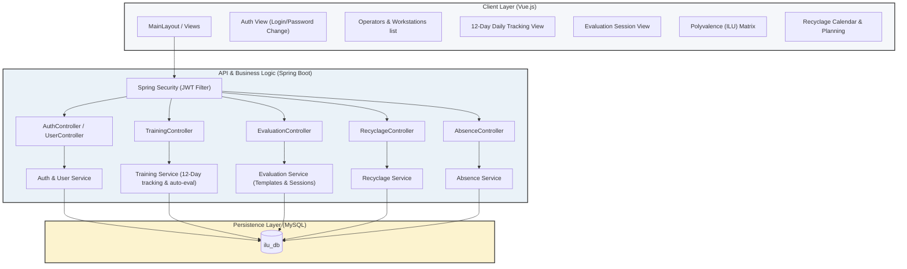

# 📊 ILU System - Complete Schema, Workflows & Edge Cases Guide

This document provides a comprehensive, detailed, step-by-step overview of the **ILU System** (Operator Skills & Training Tracker). It details the database logic (MLD), roles and permissions matrix, core system workflows (with sequence/flow diagrams), and all operational edge cases.

---

## 📌 1. What is the "ILU" System?
In Lean manufacturing (particularly at Opmobility, formerly Plastic Omnium), the **ILU Matrix** is a tool used to visualize and track operator skills on various production line workstations:
- **I (Initiated)**: The operator has basic training on the workstation but requires active supervision.
- **L (Autonomous / Libéré)**: The operator is fully qualified to work independently, achieving target cadence (speed) and satisfying quality constraints (minimal defects).
- **U (Trainer / Utilisateur)**: The operator is highly experienced and qualified to train other team members on this station.

The **ILU System** is a digital platform designed to replace manual paper sheets for tracking training progress (specifically the critical 12-day onboarding training) and managing qualifications, annual reviews, and retraining schedules after operator absences.

---

## 🏗️ 2. High-Level Architecture Schema

The system uses a modern 3-tier architecture:
- **Frontend (Vue.js)**: Dashboard, list views, and a responsive 12-day journal editor with integrated Chart.js charts.
- **Backend (Spring Boot)**: REST API utilizing Spring Security (JWT) and Spring Data JPA.
- **Database (MySQL)**: Persistent storage for users, workstation structures, operator records, training sessions, evaluations, and logs.

---

## 🗄️ 3. Logical Database Schema (ERD)

This entity-relationship diagram shows how the MySQL tables are linked.

```mermaid
erDiagram
    roles {
        int id PK
        varchar libelle UK
    }
    
    utilisateurs {
        bigint id PK
        varchar employee_id UK "matricule"
        varchar nom
        varchar cin
        varchar password
        boolean doit_changer_mdp
        boolean actif
        int role_id FK
    }

    projet {
        int id_projet PK
        varchar nom
        varchar logo
        varchar cree_par
        datetime date_creation
    }

    zone_ligne {
        int id_zone PK
        varchar nom
        int projet_id FK
        varchar cree_par
        datetime date_creation
    }

    poste {
        int id_poste PK
        varchar nom
        varchar type_poste "PRODUCTION, CONTROLE, etc."
        int cadence_objectif
        int cible_polyvalence
        int zone_id FK
        varchar cree_par
        datetime date_creation
    }

    formation_templates {
        bigint id PK
        varchar name
        text description
        varchar type "GENERIC_COMMON, POSTE_PRODUCTION, etc."
        int workstation_id FK
        varchar target_niveau "I, L, U"
        varchar status "DRAFT, VALIDATED"
        bigint created_by_id FK
        datetime created_at
    }

    evaluation_sections {
        bigint id PK
        bigint template_id FK
        varchar title
        int display_order
        text complementary_questions
    }

    evaluation_questions {
        bigint id PK
        bigint template_id FK
        bigint section_id FK
        text question_text
        text expected_answer
        int question_number
        varchar validator_role "CHEF_EQUIPE, AGENT_QUALITE, etc."
        varchar status "PENDING, VALIDATED, REJECTED"
        bigint created_by_id FK
        bigint validated_by_id FK
        varchar rejection_reason
        datetime created_at
    }

    equipe {
        int id_equipe PK
        varchar nom
        bigint chef_id FK "utilisateurs.id"
        int projet_id FK
        datetime date_creation
    }

    operators {
        bigint id PK
        varchar employee_id UK "matricule"
        varchar last_name
        varchar first_name
        varchar role
        date hire_date
        date exit_date
        varchar absence_reason
        boolean active
        int team_id FK
        int project_id FK
        int zone_id FK
        varchar operator_type "NOUVEAU_RECRU, DEJA_EN_POSTE"
    }

    onboarding_modules {
        bigint id PK
        varchar name
        varchar department
        int display_order
        varchar description
    }

    operator_onboarding {
        bigint id PK
        bigint operator_id FK
        bigint module_id FK
        boolean is_completed
        date completed_date
        varchar validated_by
        varchar comment
        date created_at
    }

    formation_assignments {
        bigint id PK
        bigint operator_id FK
        bigint workstation_id FK
        boolean is_primary_assignment
        date start_date
        date end_date
        varchar status "EN_FORMATION, VALIDEE, etc."
    }

    workstation_formations {
        bigint id PK
        bigint operator_id FK
        bigint workstation_id FK
        date start_date
        date end_date
        varchar status "EN_FORMATION, VALIDEE, ECHOUEE"
        varchar achieved_level
        varchar target_level
        int quality_objective
    }

    daily_formation_tracking {
        bigint id PK
        bigint formation_id FK "workstation_formations.id"
        date tracking_date
        int day_number "1 to 12"
        int daily_level
        varchar comment
        varchar supervisor
        int objectif
        int cadence
        int defauts
        varchar cadence_submitted_by
        varchar defects_submitted_by
    }

    absence {
        bigint id PK
        bigint operator_id FK
        date start_date
        date expected_return_date
        date actual_return_date
        varchar status "EN_COURS, TERMINEE"
        datetime created_at
    }

    recyclage_planning {
        bigint id PK
        bigint operator_id FK
        bigint workstation_id FK
        varchar type "INITIALE, INITIALE_NOUVELLE_RECRUE, EVALUATION_ANNUELLE_MOIS_1, RECYCLAGE"
        date scheduled_date
        varchar status "PLANIFIEE, EN_COURS, TERMINEE, ANNULEE"
        varchar source "ANNUELLE, NOUVELLE_RECRUE, REPRISE_ABSENCE, CHEF_EQUIPE"
        bigint project_id
        datetime created_at
        datetime completed_at
        varchar niveau_obtenu
        bigint evaluation_session_id FK
    }

    evaluation_sessions {
        bigint id PK
        bigint operator_id FK
        bigint formation_id FK "workstation_formations.id"
        bigint template_id FK
        bigint evaluator_id FK
        varchar evaluator_name
        varchar status "IN_PROGRESS, COMPLETED, PASSED, FAILED"
        int total_questions
        int correct_answers
        double score_percentage
        varchar decision
        varchar niveau "I, L, U"
        int operator_seniority_months
        varchar mode
        bigint next_template_id
        bigint planning_id FK "recyclage_planning.id"
        bigint workstation_formation_id FK
        datetime created_at
        datetime completed_at
    }

    evaluation_answers {
        bigint id PK
        bigint session_id FK
        bigint question_id FK
        varchar answer_given "YES, NO, PARTIAL"
        text comment
        varchar validated_by
        datetime answered_at
    }

    roles ||--o{ utilisateurs : "has_role"
    projet ||--o{ zone_ligne : "has"
    projet ||--o{ equipe : "has"
    projet ||--o{ operators : "assigned_to"
    zone_ligne ||--o{ poste : "has"
    zone_ligne ||--o{ operators : "assigned_to"
    poste ||--o{ formation_templates : "has_template"
    poste ||--o{ workstation_formations : "assigned_to"
    poste ||--o{ formation_assignments : "assigned_to"
    poste ||--o{ recyclage_planning : "for_station"
    equipe ||--o{ operators : "members"
    utilisateurs ||--o{ equipe : "manages"
    operators ||--o{ workstation_formations : "undertakes"
    operators ||--o{ formation_assignments : "has_general_assignment"
    operators ||--o{ operator_onboarding : "performs"
    onboarding_modules ||--o{ operator_onboarding : "defines"
    workstation_formations ||--o{ daily_formation_tracking : "tracked_by"
    operators ||--o{ absence : "has_absence"
    operators ||--o{ recyclage_planning : "scheduled_for"
    operators ||--o{ evaluation_sessions : "evaluated"
    workstation_formations ||--o{ evaluation_sessions : "has_evaluation"
    evaluation_templates ||--o{ evaluation_sections : "has_sections"
    evaluation_templates ||--o{ evaluation_questions : "contains_questions"
    evaluation_sections ||--o{ evaluation_questions : "groups_questions"
    evaluation_templates ||--o{ evaluation_sessions : "defines_session"
    recyclage_planning ||--o{ evaluation_sessions : "linked_to"
    evaluation_sessions ||--o{ evaluation_answers : "has"
    evaluation_questions ||--o{ evaluation_answers : "answers_to"
```

---

## ⚡ 4. Automatic System Generation vs. Manual Action

Understanding what the system handles behind the scenes versus what the user must execute manually.

| Action / Entity | ⚙️ Automatic System Generation | 👤 Manual User Action / Trigger |
| :--- | :--- | :--- |
| **Users & Factory Structure** | None | **Admin** manually registers Users, Projects, Zones, and Postes (Workstations). |
| **Operator Profiles** | None | **HR** manually creates the Operator Profile. |
| **Onboarding Modules** | **System** automatically assigns the 5 mandatory modules for `NOUVEAU_RECRU` operators. | **HR/Admin** selects operator type (New vs Existing). |
| **Onboarding Completion** | **System** marks status as `ONBOARDING_COMPLETE` once all 5 modules are validated. | **Team Lead / Trainer** completes onboarding sessions and manually validates each module. |
| **Training (12-Day Tracker)** | **System** creates `WorkstationFormation` and generates 12 empty `daily_formation_tracking` rows with pre-loaded targets. | **Team Lead** assigns training for an operator on a specific workstation. |
| **Daily Training Input** | None | **Team Lead** enters daily cadence & comments; **Quality Agent** enters daily defects. |
| **Auto-Evaluation (Day 12)** | **System** calculates averages/totals on Day 12 save, checking target cadence and defects limits. Updates status to `EVALUEE` (Pass) or `ECHOUEE` (Fail). | **Team Lead** saves Day 12 logs. |
| **Evaluation Session** | **System** auto-resolves templates (picks the Generic template and workstation-specific Production template). | **Qualified User** (Chef d'Équipe, Agent Qualité, etc.) starts the evaluation session. |
| **Answering Questions** | None | **Role-Specific Collaboration**: `CHEF_EQUIPE`, `AGENT_QUALITE`, `RESP_HSE`, and `RESP_QUALITE` log in to answer their respective validator questions. |
| **Session Score & Result** | **System** calculates percentage scores, verifies 100% generic requirement, and decides final status (`PASSED`, `FAILED`, or `BLOCKED`). | **Evaluator** completes the session. |
| **Skills Matrix Promotion** | **System** updates `achieved_level` to `I`, `L`, or `U` on pass, which instantly reflects on the Polyvalence Matrix. | None. |
| **Second-Chance Training** | **System** automatically initializes a new `WorkstationFormation` training when an operator fails their first evaluation. | None. |
| **Double Failure Tracking** | **System** flags the operator on the Double Failure List if they fail twice on the same workstation. | **HR** manually reassigns or offboards the operator. |
| **Absence Management** | **System** deactivates the operator on absence start, re-enables them on return, checks duration, and demotes qualified levels (L ➡️ I) if absence >= 30 days. | **HR / Manager** logs the absence start date, expected return, and actual return date. |
| **Recyclage Planning** | **System** automatically generates a retraining task in `recyclage_planning` if absence >= 30 days or if workstation qualification is within 30 days of expiration. | **Team Lead / Trainer** executes retraining and runs evaluations. |
| **Notifications & Alerts** | **System Scheduler** runs every 24 hours to automatically generate warning alerts and email flags. | None. |

---

## 👥 5. Collaborative Evaluation Answering Model

While the **Agent Qualité** or **Chef d'Équipe** can initiate the evaluation session, the session itself is designed as a **collaborative checklist** where different roles must fill in their specific questions:

- Each evaluation template is composed of multiple questions. Each question is configured with a specific `validatorRole` (`CHEF_EQUIPE`, `AGENT_QUALITE`, `RESP_HSE`, `RESP_QUALITE`).
- When a session is active (`IN_PROGRESS`), the frontend verifies the role of the logged-in user against the question's `validatorRole`:
  - **Match**: The user sees input controls (1 and 0 buttons) to validate/invalidate the operator on that question.
  - **No Match**: The input controls are hidden, showing only the current validation status (Answered/Pending) and a label indicating which role is responsible.
- **Collaborative Progress**: The UI displays a live progress tracker ("Avancement par rôle", e.g., `Chef d'Équipe (2/2) | Resp. HSE (0/1) en attente`). The session cannot be finalized until all roles have answered all of their respective questions.

---

## 🔄 6. End-to-End Operational Lifecycle Workflow

Here is the complete functional path mapping the operator's journey from onboarding and active training to qualification, absences, retraining, and double failure handling.

```mermaid
flowchart TD
    %% Styling definitions
    classDef manual fill:#3b82f6,stroke:#1d4ed8,stroke-width:2px,color:#fff;
    classDef system fill:#10b981,stroke:#047857,stroke-width:2px,color:#fff;
    classDef decision fill:#f59e0b,stroke:#b45309,stroke-width:2px,color:#fff;
    classDef failure fill:#ef4444,stroke:#b91c1c,stroke-width:2px,color:#fff;

    %% Workflow Start
    Start([HR Hires Operator]) --> OpCreate[HR creates profile & sets OperatorType]:::manual
    
    OpCreate --> OpCheck{Operator Type?}:::decision
    
    %% Onboarding Branch
    OpCheck -- NOUVEAU_RECRU --> AutoOnboard[System auto-assigns 5 Onboarding Modules]:::system
    AutoOnboard --> PerformOnboard[Team Lead/HSE Trainer performs sessions & validates modules]:::manual
    PerformOnboard --> OnboardDone{All 5 Modules Passed?}:::decision
    OnboardDone -- No --> PerformOnboard
    OnboardDone -- Yes --> SetOnboardStatus[System sets status to ONBOARDING_COMPLETE]:::system
    
    %% Main Technical Path
    OpCheck -- DEJA_EN_POSTE --> CreateTraining[Team Lead assigns Workstation Training]:::manual
    SetOnboardStatus --> CreateTraining
    
    CreateTraining --> AutoTrainingInit["System generates 12 tracking days & preloads targets"]:::system
    
    %% 12 Day Tracking Loop
    AutoTrainingInit --> DailyInput["Daily Logs:<br/>- Chef d'Équipe: Cadence & Comments<br/>- Agent Qualité: Defects"]:::manual
    DailyInput --> TrackerLoop{Day 12 Completed?}:::decision
    TrackerLoop -- No --> DailyInput
    
    %% Auto Evaluation
    TrackerLoop -- Yes --> AutoEval["System runs Auto-Evaluation:<br/>Checks Avg Cadence vs Target & Defects limit"]:::system
    AutoEval --> AutoEvalCheck{Goal Met?}:::decision
    
    %% 12 Day Fail Branch
    AutoEvalCheck -- No --> SetFailStatus[System sets status to ECHOUEE]:::system
    SetFailStatus --> FailCheck{Second Failure on this poste?}:::decision
    FailCheck -- Yes --> DoubleFailList[System flags operator in RH Double Failure list]:::failure
    DoubleFailList --> HRAction[HR handles manually: reallocation or contract review]:::manual
    FailCheck -- No --> CreateSecondChance["System auto-creates 2nd WorkstationFormation retry"]:::system
    CreateSecondChance --> DailyInput
    
    %% Evaluation Session
    AutoEvalCheck -- Yes --> SetEvalReady[System sets status to EVALUEE]:::system
    SetEvalReady --> StartEvalSession[Qualified User starts formal Evaluation Session]:::manual
    StartEvalSession --> AutoResolveTemplates[System auto-picks Generic & Production templates]:::system
    
    %% Collaborative Questions
    AutoResolveTemplates --> AnswerQ["Collaborative Question Answering:<br/>CHEF_EQUIPE, AGENT_QUALITE, RESP_HSE, and RESP_QUALITE<br/>fill questions assigned to their roles"]:::manual
    AnswerQ --> EvalCompleted{All questions answered?}:::decision
    EvalCompleted -- No --> AnswerQ
    
    %% Evaluation Grading
    EvalCompleted -- Yes --> SubmitEval[Evaluator completes session & System grades score]:::system
    SubmitEval --> GradeCheck{Score >= 80% & Generic 100%?}:::decision
    
    %% Eval Failure Branch
    GradeCheck -- No --> SetSessionFailed[System marks Session & Training: FAILED/ECHOUEE]:::system
    SetSessionFailed --> FailCheck
    
    %% Eval Success Branch
    GradeCheck -- Yes --> PromoteOp[System marks Training: VALIDEE & determines Level I, L, or U]:::system
    PromoteOp --> UpdateMatrix[System updates Polyvalence Matrix instantly]:::system
    
    %% Active Work Status / Absences
    UpdateMatrix --> ActiveWork[Operator works autonomously in production]:::manual
    
    ActiveWork --> EventCheck{Operational Event?}:::decision
    
    %% Absence Sub-flow
    EventCheck -- Operator Absent --> LogAbsence[HR logs Operator Absence & Start Date]:::manual
    LogAbsence --> DeactivateOp[System sets operator active = false]:::system
    DeactivateOp --> LogReturn[HR logs Actual Return Date]:::manual
    LogReturn --> ReactivateOp[System sets operator active = true]:::system
    ReactivateOp --> AbsenceDurationCheck{Absence >= 30 Days?}:::decision
    AbsenceDurationCheck -- No --> ActiveWork
    AbsenceDurationCheck -- Yes --> DemoteOpLevel[System demotes active qualified levels: L to I]:::system
    DemoteOpLevel --> TriggerRecyclage[System automatically schedules Retraining in recyclage_planning]:::system
    TriggerRecyclage --> RetrainTraining[Team Lead runs targeted retraining evaluation]:::manual
    RetrainTraining --> ActiveWork
    
    %% Scheduler Sub-flow
    EventCheck -- Daily 24h Scheduler Check --> SchedulerRun[System runs background task]:::system
    SchedulerRun --> CheckExpiry{Qualification expires in <= 30 Days?}:::decision
    CheckExpiry -- No --> ActiveWork
    CheckExpiry -- Yes --> TriggerRecyclage
    
    %% Class declarations for visual elements
    class OpCreate,PerformOnboard,CreateTraining,DailyInput,StartEvalSession,AnswerQ,ActiveWork,LogAbsence,LogReturn,RetrainTraining manual;
    class AutoOnboard,SetOnboardStatus,AutoTrainingInit,AutoEval,SetFailStatus,CreateSecondChance,SetEvalReady,AutoResolveTemplates,SubmitEval,PromoteOp,UpdateMatrix,DeactivateOp,ReactivateOp,DemoteOpLevel,TriggerRecyclage,SchedulerRun system;
    class OpCheck,OnboardDone,TrackerLoop,AutoEvalCheck,FailCheck,EvalCompleted,GradeCheck,EventCheck,AbsenceDurationCheck,CheckExpiry decision;
    class DoubleFailList,SetSessionFailed failure;
```

---

## 🔐 7. Roles & Permissions Matrix

The system enforces strict access control policies to maintain data integrity and audit logs:

| Feature / Action | Admin | Chef d'Équipe | Agent Qualité | RH (HR) | Superviseur | Responsable HSE | Responsable Qualité |
| :--- | :---: | :---: | :---: | :---: | :---: | :---: | :---: |
| **Manage Users & Credentials** | 🔓 Yes | ❌ No | ❌ No | ❌ No | ❌ No | ❌ No | ❌ No |
| **Create Projects, Zones, Postes** | 🔓 Yes | ❌ No | ❌ No | ❌ No | ❌ No | ❌ No | ❌ No |
| **Manage Operator Profiles** | 🔓 Yes | ❌ No | ❌ No | 🔓 Yes | ❌ No | ❌ No | ❌ No |
| **Complete Onboarding Modules** | 🔓 Yes | 🔓 Yes | ❌ No | ❌ No | ❌ No | 🔓 Yes | ❌ No |
| **Assign Workstation Training** | 🔓 Yes | 🔓 Yes | ❌ No | ❌ No | ❌ No | ❌ No | ❌ No |
| **Log 12-Day Daily Cadence** | 🔓 Yes | 🔓 Yes | ❌ No | ❌ No | ❌ No | ❌ No | ❌ No |
| **Log 12-Day Daily Defects** | 🔓 Yes | ❌ No | 🔓 Yes | ❌ No | ❌ No | ❌ No | ❌ No |
| **Perform Formal Evaluations** | 🔓 Yes | 🔓 Yes | 🔓 Yes | ❌ No | 🔓 Yes | ❌ No | 🔓 Yes |
| **Create/Edit Eval Templates** | 🔓 Yes | 🔓 Yes | 🔓 Yes | ❌ No | 🔓 Yes | 🔓 Yes | 🔓 Yes |
| **Approve/Reject Eval Questions**| 🔓 Yes | ❌ No | ❌ No | ❌ No | ❌ No | ❌ No | 🔓 Yes |
| **Log Absences & Returns** | 🔓 Yes | ❌ No | ❌ No | 🔓 Yes | ❌ No | ❌ No | ❌ No |
| **View Polyvalence Matrix** | 🔓 Yes | 🔓 Yes | 🔓 Yes | 🔓 Yes | 🔓 Yes | 🔓 Yes | 🔓 Yes |
| **Access Double Failure List** | 🔓 Yes | 🔓 Yes | 🔓 Yes | 🔓 Yes | 🔓 Yes | ❌ No | 🔓 Yes |

---

## ⚠️ 8. Operational Edge Cases & Business Rules

### 1. The Double Failure Process ("Double Échec")
* **Definition**: An operator fails twice (either by failing the 12-day auto-evaluation twice, failing the formal evaluation twice, or one of each) on the **same workstation**.
* **System Action**: 
  1. The operator is flagged on the **RH Dashboard** within the **Double Failure List**.
  2. The system blocks new training assignments for this operator on the failed workstation.
* **Operational Action**: This situation requires administrative handling by HR. The operator must be reassigned to a different workstation or department, or undergo a contract review.

### 2. Daily Tracking Segregation of Duties
* **Problem**: Prevent team leads from inflating performance numbers or concealing production defects.
* **Solution**: The system enforces input segregation:
  * **Team Lead (Chef d'Équipe)** has read/write access only to **Cadence** and **Comments**.
  * **Quality Agent (Agent Qualité)** has read/write access only to **Defects (Défauts)**.
  * Attempts to bypass this via the API return `HTTP 403 Forbidden`.

### 3. Missing or Incomplete Daily Logs during 12-Day Training
* **Problem**: Operators may be absent or lines may shut down during the 12-day training window, leaving gaps in the journal.
* **Solution**: 
  * The 12-day journal does not require data to be entered on consecutive calendar days; it tracks training days.
  * The auto-evaluation average calculation ignores days with null or zero values.
  * However, a training session cannot be set to `EVALUEE` until all 12 days have at least one valid performance log entry.

### 4. Long Absence Resets
* **Rule**: When an operator is absent:
  * **Between 15 to 30 days**: A notification is sent to the Team Lead to monitor performance on return, but no automated retraining is scheduled.
  * **Greater than 30 days**: The operator's level on all previously qualified stations is downgraded from **L** (Autonomous) to **I** (Initiated). A retraining schedule is automatically generated in `recyclage_planning` to run a 3-day abbreviated tracking program or a formal evaluation session.
